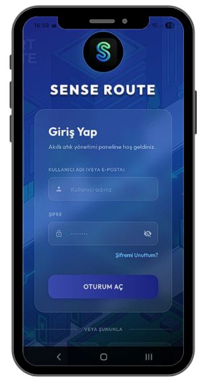
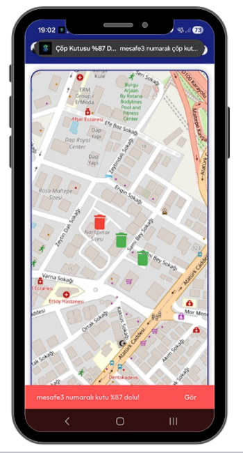
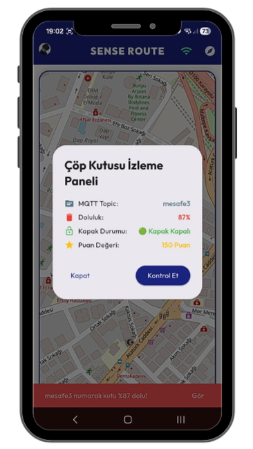
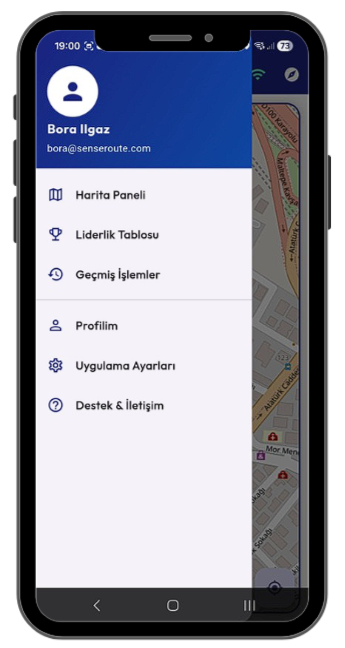
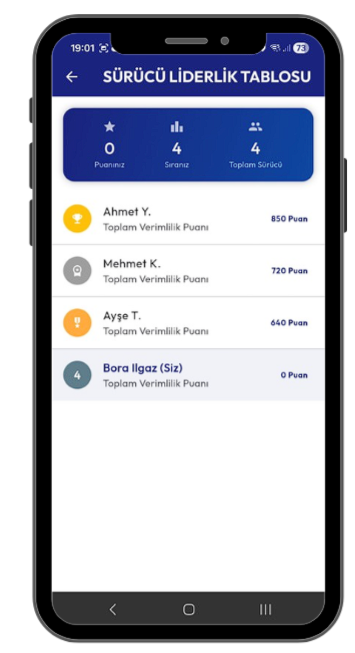
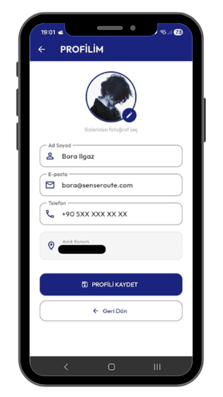

# 🗑️ Sense-Route: Akıllı Atık Yönetimi ve Rota Optimizasyonu

**Sense-Route**, şehir temizlik operasyonlarını optimize etmek için IoT ve mobil uygulama teknolojilerini birleştiren yenilikçi bir çözümdür. 

## 📱 Uygulama Arayüzü

Projenin modern ve kullanıcı dostu arayüzüne ait görseller aşağıdadır:

| Giriş Ekranı | Harita & Bildirim | Çöp Kutusu Detay |
| :---: | :---: | :---: |
|  |  |  |

| Uygulama Menüsü | Liderlik Tablosu | Profil Sayfası |
| :---: | :---: | :---: |
|  |  |  |

## 🚀 Öne Çıkan Özellikler

* **Gerçek Zamanlı Takip:** ESP8266 WiFi modülü ve mesafe sensörleri aracılığıyla çöp kutularının doluluk oranlarını ve kapak durumlarını anlık izleme.
* **Akıllı Rota:** Harita üzerinde, sokak verilerini baz alarak en yakın dolu kutuya giden en kısa yolu hesaplama.
* **Güvenlik Mekanizması:** Kapak açılması gibi durumlarda anlık bildirim sistemi ile operasyonel güvenlik sağlama.
* **Oyunlaştırma (Gamification):** Personel motivasyonunu artırmak için mesafe bazlı puanlama ve liderlik tablosu sistemi.

## 🛠️ Teknik Altyapı

* **Donanım:** ESP8266, Ultrasonik Mesafe Sensörü
* **Haberleşme:** MQTT Protokolü
* **Yazılım:** Flutter / C# .NET
* **Tasarım:** Modern UI/UX yaklaşımı ile geliştirilmiş mobil arayüz.

* ## 🔌 Donanım ve Devre Yapısı

Sense-Route projesinin IoT sensör modülü, çöp konteynerlerinin doluluk oranını ve kapak durumunu anlık olarak takip edecek şekilde tasarlanmıştır. Sistemin temelini düşük maliyetli ve yüksek WiFi performanslı **ESP8266** WiFi modülü oluşturmaktadır.

### Devre Şeması (Şablonu)

Aşağıdaki şemada, sensör modülünün bağlantı yapısı ve veri akış yönleri detaylandırılmıştır:

### Donanım Bileşenleri ve Çalışma Mantığı

Devre şemasında görüldüğü üzere sistem şu bileşenlerden oluşmaktadır:

* **ESP8266 WiFi Modülü (MCU):** Sistemin ana beyni. Sensörden veri alır, MQTT protokolü ile buluta iletir.
* **A.Ş.E. (Ultrasonik Mesafe Sensörü) -> `Ultrasonik_Sensor`**: Konteyner kapağına yerleştirilir. Çöpün tabanına bakacak şekilde ultrasonik ses dalgaları göndererek mesafeyi ölçer. Bu veri, doluluk oranını belirlemek için kullanılır.
* **`Kapak_Durum_Sensoru`:** Kapak açılma durumunu takip eden dijital bir sensör (Örn: Manyetik veya ivmeölçer). Kapak açıldığında anlık bildirim göndererek güvenliği sağlar.
* **Enerji Yönetimi -> `DC_Power_Block`:** Sistemin enerji ihtiyacını sağlayan güç bloğu.

### Veri Akışı
1.  Sensörler (`Mesafe` ve `Kapak`) verileri ESP8266'ya iletir.
2.  ESP8266, verileri işler.
3.  Veriler, MQTT protokolü üzerinden yayınlanır (`MQTT_Publish`).
4.  Bu veriler buluta (`MQTT_Broker`) iletilerek mobil uygulamada görüntülenir.

## 🔒 Lisans

Bu proje **Creative Commons Zero v1.0 Universal** lisansı ile sunulmaktadır. Kaynak kodları fikri mülkiyet hakları gereği kapalı tutulmaktadır. Teknik detaylar için LinkedIn üzerinden iletişime geçebilirsiniz.
